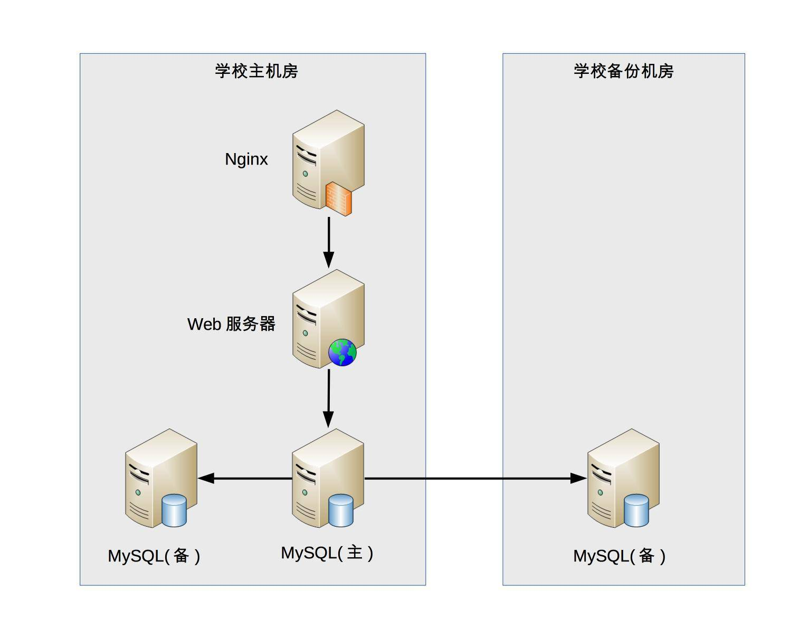

## 从零开始学架构

### 一、架构到底是指什么

参考维基百科的定义，我将架构重新定义为：**软件架构指软件系统的顶层结构**。

这个定义看似很简单，但包含的信息很丰富，基本上把系统、子系统、模块、组件、架构等概念都串起来了，我来详细解释一下。

- 首先，“系统是一群关联个体组成”，这些“个体”可以是“子系统”“模块”“组件”等；架构需要明确系统包含哪些“个体”。
- 其次，系统中的个体需要“根据某种规则”运作，架构需要明确个体运作和协作的规则。
- 第三，维基百科定义的架构用到了“基础结构”这个说法，我改为“顶层结构”，可以更好地区分系统和子系统，避免将系统架构和子系统架构混淆在一起导致架构层次混乱。 

架构是顶层设计；框架是面向编程或配置的半成品；组件是从技术维度上的复用；模块是从业务维度上职责的划分；系统是相互协同可运行的实体。 

------

### 二、架构设计的历史背景

#### 1940年之前

使用的是**机器语言**

例如，在 8086 机器上完成“s=768+12288-1280”的数学运算，机器码如下： 

```
101100000000000000000011
000001010000000000110000
001011010000000000000101
```

归纳一下，机器语言的主要问题是三难：**太难写、太难读、太难改**！ 

#### 汇编语言（20 世纪 40 年代）

为了解决机器语言编写、阅读、修改复杂的问题，**汇编语言**应运而生。汇编语言又叫“**符号语言**”，用助记符代替机器指令的操作码，用地址符号（Symbol）或标号（Label）代替指令或操作数的地址。例如，为了完成“将寄存器 BX 的内容送到 AX 中”的简单操作，汇编语言和机器语言分别如下。 

```
机器语言：1000100111011000
汇编语言：mov ax,bx
```

汇编语言虽然解决了机器语言读写复杂的问题，但本质上还是**面向机器**的，因为写汇编语言需要我们精确了解计算机底层的知识。 

例如，对于程序员来说，在现实世界中面对的问题是 4 + 6 = ？。而要用汇编语言实现一个简单的加法运算，代码如下： 

```
.section .data
  a: .int 10
  b: .int 20
  format: .asciz "%d\n"
.section .text
.global _start
_start:
  movl a, %edx　　
  addl b, %edx　　
  pushl %edx
  pushl $format
  call printf
  movl $0, (%esp)
  call exit
```

#### 高级语言（20 世纪 50 年代） 

为了解决汇编语言的问题，计算机前辈们从 20 世纪 50 年代开始又设计了多个**高级语言**，最初的高级语言有下面几个，并且这些语言至今还在特定的领域继续使用。 

- Fortran：1955 年，名称取自”FORmula TRANslator”，即公式翻译器，由约翰·巴科斯（John Backus）等人发明。
- LISP：1958 年，名称取自”LISt Processor”，即枚举处理器，由约翰·麦卡锡（John McCarthy）等人发明。
- Cobol：1959 年，名称取自”Common Business Oriented Language”，即通用商业导向语言，由葛丽丝·霍普（Grace Hopper）发明。 

还是以 4 + 6=？这个加法为例，如果用 LISP 语言实现，只需要简单一行代码即可： 

```
(+ 4 6)
```

#### 第一次软件危机与结构化程序设计（20 世纪 60 年代~20 世纪 70 年代） 

软件危机最典型的例子莫过于 IBM 的 System/360 的操作系统开发。佛瑞德·布鲁克斯（Frederick P. Brooks, Jr.）作为项目主管，率领 2000 多个程序员夜以继日地工作，共计花费了 5000 人一年的工作量，写出将近 100 万行的源码，总共投入 5 亿美元，是美国的“曼哈顿”原子弹计划投入的 1/4。尽管投入如此巨大，但项目进度却一再延迟，软件质量也得不到保障。布鲁克斯后来基于这个项目经验而总结的《人月神话》一书，成了畅销的软件工程书籍。 

“结构化程序设计”作为另外一种解决软件危机的方案被提了出来。艾兹赫尔·戴克斯特拉（Edsger Dijkstra）于 1968 年发表了著名的《GOTO 有害论》论文，引起了长达数年的论战，并由此产生了**结构化程序设计方法**。同时，第一个结构化的程序语言 Pascal 也在此时诞生，并迅速流行起来。

结构化程序设计的主要特点是抛弃 goto 语句，采取“自顶向下、逐步细化、模块化”的指导思想。结构化程序设计本质上还是一种面向过程的设计思想，但通过“自顶向下、逐步细化、模块化”的方法，将软件的复杂度控制在一定范围内，从而从整体上降低了软件开发的复杂度。结构化程序方法成为了 20 世纪 70 年代软件开发的潮流。 

#### 第二次软件危机与面向对象（20 世纪 80 年代） 

第二次软件危机的根本原因还是在于软件生产力远远跟不上硬件和业务的发展。第一次软件危机的根源在于软件的**“逻辑”变得非常复杂**，而第二次软件危机主要体现在软件的**“扩展”变得非常复杂**。结构化程序设计虽然能够解决（也许用“缓解”更合适）软件逻辑的复杂性，但是对于业务变化带来的软件扩展却无能为力，软件领域迫切希望找到新的银弹来解决软件危机，在这种背景下，**面向对象的思想**开始流行起来。 

虽然面向对象开始也被当作解决软件危机的银弹，但事实证明，和软件工程一样，**面向对象也不是银弹**，而只是一种新的软件方法而已。 

#### 软件架构的历史背景

虽然早在 20 世纪 60 年代，戴克斯特拉这位上古大神就已经涉及软件架构这个概念了，但软件架构真正流行却是从 20 世纪 90 年代开始的，由于在 Rational 和 Microsoft 内部的相关活动，软件架构的概念开始越来越流行了。

与之前的各种新方法或者新理念不同的是，“软件架构”出现的背景并不是整个行业都面临类似相同的问题，“软件架构”也不是为了解决新的软件危机而产生的，这是怎么回事呢？

卡内基·梅隆大学的玛丽·肖（Mary Shaw）和戴维·加兰（David Garlan）对软件架构做了很多研究，他们在 1994 年的一篇文章《软件架构介绍》（An Introduction to Software Architecture）中写到： 

> 随着软件系统规模的增加，计算相关的算法和数据结构不再构成主要的设计问题；当系统由许多部分组成时，整个系统的组织，也就是所说的“软件架构”，导致了一系列新的设计问题。 

这段话很好地解释了“软件架构”为何先在 Rational 或者 Microsoft 这样的大公司开始逐步流行起来。因为只有大公司开发的软件系统才具备较大规模，而只有规模较大的软件系统才会面临软件架构相关的问题，例如：

- 系统规模庞大，内部耦合严重，开发效率低；
- 系统耦合严重，牵一发动全身，后续修改和扩展困难；
- 系统逻辑复杂，容易出问题，出问题后很难排查和修复。

软件架构的出现有其历史必然性。20 世纪 60 年代第一次软件危机引出了“结构化编程”，创造了“模块”概念；20 世纪 80 年代第二次软件危机引出了“面向对象编程”，创造了“对象”概念；到了 20 世纪 90 年代“软件架构”开始流行，创造了“组件”概念。我们可以看到，“模块”“对象”“组件”本质上都是对达到一定规模的软件进行拆分，差别只是在于随着软件的复杂度不断增加，拆分的粒度越来越粗，拆分的层次越来越高。

《人月神话》中提到的 IBM 360 大型系统，开发时间是 1964 年，那个时候结构化编程都还没有提出来，更不用说软件架构了。如果 IBM 360 系统放在 20 世纪 90 年代开发，不管是质量还是效率、成本，都会比 1964 年开始做要好得多，当然，这样的话我们可能就看不到《人月神话》了。 

#### 小结

软件开发最本质的挑战有两个:复杂和变更，而软件的价值是保证业务的响应力，而与之相对的是开发资源的有限，而各种的软件开发方法论，也都是在研究有限的资源下，如何应对着两个挑战，寻找平衡点，实现业务目标，因为是在寻找平衡点，就说明是有取舍的，所以就没有所谓的银弹的存在 。

------

### 三、架构设计的目的

####架构设计的误区

关于架构设计的目的，常见的误区有：

- **因为架构很重要，所以要做架构设计**

这是一句正确的废话，架构是很重要，但架构为何重要呢？

例如：不做架构设计系统就跑不起来么？其实不然，很多朋友尤其是经历了创业公司的朋友可能会发现，公司的初始产品可能没有架构设计，大伙撸起袖子简单讨论一下就开始编码了，根本没有正规的架构设计过程，而且也许产品开发速度还更快，上线后运行也还不错。

例如：做了架构设计就能提升开发效率么？也不尽然，实际上有时候最简单的设计开发效率反而是最高的，架构设计毕竟需要投入时间和人力，这部分投入如果用来尽早编码，项目也许会更快。

例如：设计良好的架构能促进业务发展么？好像有一定的道理，例如设计高性能的架构能够让用户体验更好，但反过来想，我们照抄微信的架构，业务就能达到微信的量级么？肯定不可能，不要说达到微信的量级，达到微信的 1/10 做梦都要笑醒了。

- **不是每个系统都要做架构设计吗**

这其实是知其然不知其所以然，系统确实要做架构设计，但还是不知道为何要做架构设计，反正大家都要做架构设计，所以做架构设计肯定没错。

这样的架构师或者设计师很容易走入生搬硬套业界其他公司已有架构的歧路，美其名曰“参考”“微改进”。一旦强行引入其他公司架构后，很可能会发现架构水土不服，或者运行起来很别扭等各种情况，最后往往不得不削足适履，或者不断重构，甚至无奈推倒重来。 

- **公司流程要求系统开发过程中必须有架构设计** 

与此答案类似还有因为“架构师总要做点事情”，所以要做架构设计，其实都是舍本逐末。因为流程有规定，所以要做架构设计；因为架构师要做事，所以要做架构设计，这都是很表面地看问题，并没有真正理解为何要做架构设计，而且很多需求并不一定要进行架构设计。如果认为架构师一定要找点事做，流程一定要进行架构设计，就会出现事实上不需要架构设计但形式上却继续去做架构设计，不但浪费时间和人力，还会拖慢整体的开发进度。 

- **为了高性能、高可用、可扩展，所以要做架构设计** 

能够给出这个答案，说明已经有了一定的架构经历或者基础，毕竟确实很多架构设计都是冲着高性能、高可用……等“高 XX”的目标去的。

但往往持有这类观点的架构师和设计师会给项目带来巨大的灾难，这绝不是危言耸听，而是很多实际发生的事情，为什么会这样呢？因为这类架构师或者设计师不管三七二十一，不管什么系统，也不管什么业务，上来就要求“高性能、高可用、高扩展”，结果就会出现架构设计复杂无比，项目落地遥遥无期，团队天天吵翻天……等各种让人抓狂的现象，费尽九牛二虎之力将系统整上线，却发现运行不够稳定，经常出问题，出了问题很难解决，加个功能要改 1 个月……等各种继续让人抓狂的事件。 

#### 架构设计的真正目的 

那架构设计的真正目的究竟是什么？

从周二与你分享的架构设计的历史背景，可以看到，整个软件技术发展的历史，其实就是一部与“复杂度”斗争的历史，架构的出现也不例外。简而言之，架构也是为了应对软件系统复杂度而提出的一个解决方案，通过回顾架构产生的历史背景和原因，我们可以基本推导出答案：**<u>架构设计的主要目的是为了解决软件系统复杂度带来的问题</u>**。

这个结论虽然很简洁，但却是架构设计过程中需要时刻铭记在心的一条准则，为什么这样说呢？

首先，遵循这条准则能够让“新手”架构师**心中有数，而不是一头雾水**。

新手架构师开始做架构设计的时候，心情都很激动，希望大显身手，甚至恨不得一出手就设计出世界上最牛的 XX 架构，从此走上人生巅峰，但真的面对具体的需求时，往往都会陷入一头雾水的状态：

> “这么多需求，从哪里开始下手进行架构设计呢？”。
>
> “架构设计要考虑高性能、高可用、高扩展……这么多高 XX，全部设计完成估计要 1 个月，但老大只给了 1 周时间”。
>
> “业界 A 公司的架构是 X，B 公司的方案是 Y，两个差别比较大，该参考哪一个呢？”。

以上类似问题，如果明确了“架构设计是为了解决软件复杂度”原则后，就很好回答。 

* **“这么多需求，从哪里开始下手进行架构设计呢？”**

——通过熟悉和理解需求，识别系统复杂性所在的地方，然后针对这些复杂点进行架构设计。

* **“架构设计要考虑高性能、高可用、高扩展……这么多高 XX，全部设计完成估计要 1 个月，但老大只给了 1 周时间”**

——架构设计并不是要面面俱到，不需要每个架构都具备高性能、高可用、高扩展等特点，而是要识别出复杂点然后有针对性地解决问题。

* **“业界 A 公司的架构是 X，B 公司的方案是 Y，两个差别比较大，该参考哪一个呢？”**

——理解每个架构方案背后所需要解决的复杂点，然后才能对比自己的业务复杂点，参考复杂点相似的方案。

其次，遵循这条准则能够让“老鸟”架构师**有的放矢，而不是贪大求全**。

技术人员往往都希望自己能够做出最牛的东西，架构师也不例外，尤其是一些“老鸟”架构师，为了证明自己的技术牛，可能会陷入贪大求全的焦油坑而无法自拔。例如：

> “我们的系统一定要做到每秒 TPS 10 万”。
>
> “淘宝的架构是这么做的，我们也要这么做”。
>
> “Docker 现在很流行，我们的架构应该将 Docker 应用进来”。

以上这些想法，如果拿“架构设计是为了解决软件复杂度”这个原则来衡量，就很容易判断。

* **“我们的系统一定要做到每秒 TPS 10 万”**

——如果系统的复杂度不是在性能这部分，TPS 做到 10 万并没有什么用。

* **“淘宝的架构是这么做的，我们也要这么做”**

——淘宝的架构是为了解决淘宝业务的复杂度而设计的，淘宝的业务复杂度并不就是我们的业务复杂度，绝大多数业务的用户量都不可能有淘宝那么大。

* **“Docker 现在很流行，我们的架构应该将 Docker 应用进来”**

——Docker 不是万能的，只是为了解决资源重用和动态分配而设计的，如果我们的系统复杂度根本不是在这方面，引入 Docker 没有什么意义。

#### 简单的复杂度分析案例 

我来分析一个简单的案例，一起来看看如何将“架构设计的真正目的是为了解决软件系统复杂度带来的问题”这个指导思想应用到实践中。

假设我们需要设计一个大学的学生管理系统，其基本功能包括登录、注册、成绩管理、课程管理等。当我们对这样一个系统进行架构设计的时候，首先应识别其复杂度到底体现在哪里。

性能：一个学校的学生大约 1 ~ 2 万人，学生管理系统的访问频率并不高，平均每天单个学生的访问次数平均不到 1 次，因此性能这部分并不复杂，存储用 MySQL 完全能够胜任，缓存都可以不用，Web 服务器用 Nginx 绰绰有余。

可扩展性：学生管理系统的功能比较稳定，可扩展的空间并不大，因此可扩展性也不复杂。

高可用：学生管理系统即使宕机 2 小时，对学生管理工作影响并不大，因此可以不做负载均衡，更不用考虑异地多活这类复杂的方案了。但是，如果学生的数据全部丢失，修复是非常麻烦的，只能靠人工逐条修复，这个很难接受，因此需要考虑存储高可靠，这里就有点复杂了。我们需要考虑多种异常情况：机器故障、机房故障，针对机器故障，我们需要设计 MySQL 同机房主备方案；针对机房故障，我们需要设计 MySQL 跨机房同步方案。

安全性：学生管理系统存储的信息有一定的隐私性，例如学生的家庭情况，但并不是和金融相关的，也不包含强隐私（例如玉照、情感）的信息，因此安全性方面只要做 3 个事情就基本满足要求了：Nginx 提供 ACL 控制、用户账号密码管理、数据库访问权限控制。

成本：由于系统很简单，基本上几台服务器就能够搞定，对于一所大学来说完全不是问题，可以无需太多关注。

还有其他方面，如果有兴趣，你可以自行尝试去分析。通过我上面的分析，可以看到这个方案的主要复杂性体现在存储可靠性上，需要保证异常的时候，不要丢失所有数据即可（丢失几个或者几十个学生的信息问题不大），对应的架构如下：



学生管理系统虽然简单，但麻雀虽小五脏俱全，基本上能涵盖软件系统复杂度分析的各个方面，而且绝大部分技术人员都曾经自己设计或者接触过类似的系统，如果将这个案例和自己的经验对比，相信会有更多的收获。 

------

